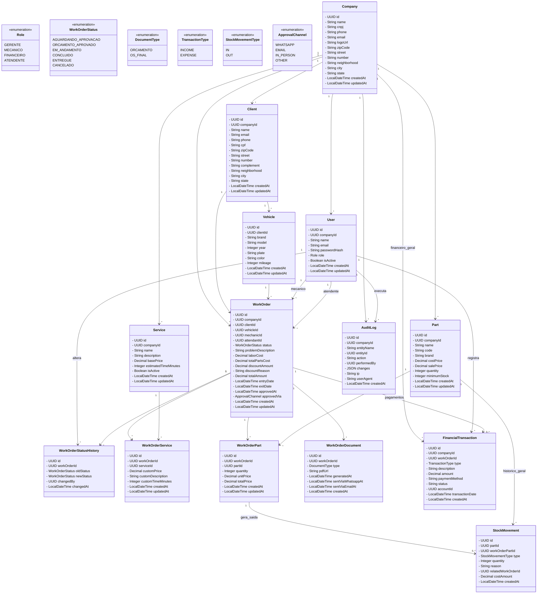

## 📍 Diagrama

```mermaid

classDiagram


  %% =========================

  %% ENUMS

  %% =========================

  class Role {

    <<enumeration>>

    GERENTE

    MECANICO

    FINANCEIRO

    ATENDENTE

  }


  class WorkOrderStatus {

    <<enumeration>>

    AGUARDANDO_APROVACAO

    ORCAMENTO_APROVADO

    EM_ANDAMENTO

    CONCLUIDO

    ENTREGUE

    CANCELADO

  }


  class DocumentType {

    <<enumeration>>

    ORCAMENTO

    OS_FINAL

  }


  class TransactionType {

    <<enumeration>>

    INCOME

    EXPENSE

  }


  class StockMovementType {

    <<enumeration>>

    IN

    OUT

  }


  class ApprovalChannel {

    <<enumeration>>

    WHATSAPP

    EMAIL

    IN_PERSON

    OTHER

  }


  %% =========================

  %% EMPRESA (OFICINA)

  %% =========================

  class Company {

    - UUID id

    - String name

    - String cnpj

    - String phone

    - String email

    - String logoUrl

    - String zipCode

    - String street

    - String number

    - String neighborhood

    - String city

    - String state

    - LocalDateTime createdAt

    - LocalDateTime updatedAt

  }


  %% =========================

  %% USERS

  %% =========================

  class User {

    - UUID id

    - UUID companyId

    - String name

    - String email

    - String passwordHash

    - Role role

    - Boolean isActive

    - LocalDateTime createdAt

    - LocalDateTime updatedAt

  }


  %% =========================

  %% CLIENTES

  %% =========================

  class Client {

    - UUID id

    - UUID companyId

    - String name

    - String email

    - String phone

    - String cpf

    - String zipCode

    - String street

    - String number

    - String complement

    - String neighborhood

    - String city

    - String state

    - LocalDateTime createdAt

    - LocalDateTime updatedAt

  }


  %% =========================

  %% VEICULOS

  %% =========================

  class Vehicle {

    - UUID id

    - UUID clientId

    - String brand

    - String model

    - Integer year

    - String plate

    - String color

    - Integer mileage

    - LocalDateTime createdAt

    - LocalDateTime updatedAt

  }


  %% =========================

  %% SERVICOS (CATALOGO)

  %% =========================

  class Service {

    - UUID id

    - UUID companyId

    - String name

    - String description

    - Decimal basePrice

    - Integer estimatedTimeMinutes

    - Boolean isActive

    - LocalDateTime createdAt

    - LocalDateTime updatedAt

  }


  %% =========================

  %% PECAS (ESTOQUE)

  %% =========================

  class Part {

    - UUID id

    - UUID companyId

    - String name

    - String code

    - String brand

    - Decimal costPrice

    - Decimal salePrice

    - Integer quantity

    - Integer minimumStock

    - LocalDateTime createdAt

    - LocalDateTime updatedAt

  }


  %% =========================

  %% MOVIMENTACAO DE ESTOQUE

  %% =========================

  class StockMovement {

    - UUID id

    - UUID partId

    - UUID workOrderPartId  

    - StockMovementType type

    - Integer quantity

    - String reason

    - UUID relatedWorkOrderId

    - Decimal costAmount  

    - LocalDateTime createdAt

  }


  %% =========================

  %% ORDEM DE SERVICO

  %% =========================

  class WorkOrder {

    - UUID id

    - UUID companyId

    - UUID clientId

    - UUID vehicleId

    - UUID mechanicId

    - UUID attendantId

    - WorkOrderStatus status

    - String problemDescription

    - Decimal laborCost

    - Decimal totalPartsCost

    - Decimal discountAmount

    - String discountReason

    - Decimal totalAmount

    - LocalDateTime entryDate

    - LocalDateTime exitDate

    - LocalDateTime approvedAt

    - ApprovalChannel approvedVia

    - LocalDateTime createdAt

    - LocalDateTime updatedAt

  }


  %% =========================

  %% HISTORICO DE STATUS

  %% =========================

  class WorkOrderStatusHistory {

    - UUID id

    - UUID workOrderId

    - WorkOrderStatus oldStatus  

    - WorkOrderStatus newStatus

    - UUID changedBy

    - LocalDateTime changedAt

  }


  %% =========================

  %% SERVICOS DA OS

  %% =========================

  class WorkOrderService {

    - UUID id

    - UUID workOrderId

    - UUID serviceId

    - Decimal customPrice  

    - String customDescription

    - Integer customTimeMinutes

    - LocalDateTime createdAt

    - LocalDateTime updatedAt

  }


  %% =========================

  %% PECAS DA OS

  %% =========================

  class WorkOrderPart {

    - UUID id

    - UUID workOrderId

    - UUID partId

    - Integer quantity

    - Decimal unitPrice  

    - Decimal totalPrice

    - LocalDateTime createdAt

    - LocalDateTime updatedAt

  }


  %% =========================

  %% DOCUMENTOS

  %% =========================

  class WorkOrderDocument {

    - UUID id

    - UUID workOrderId

    - DocumentType type

    - String pdfUrl

    - LocalDateTime generatedAt

    - LocalDateTime sentViaWhatsappAt

    - LocalDateTime sentViaEmailAt

    - LocalDateTime createdAt

  }


  %% =========================

  %% FINANCEIRO (1:N)

  %% =========================

  class FinancialTransaction {

    - UUID id

    - UUID companyId

    - UUID workOrderId  

    - TransactionType type

    - String description

    - Decimal amount

    - String paymentMethod

    - String status  

    - UUID accountId

    - LocalDateTime transactionDate

    - LocalDateTime createdAt

  }


  %% =========================

  %% AUDITORIA GERAL

  %% =========================

  class AuditLog {

    - UUID id

    - UUID companyId

    - String entityName

    - UUID entityId

    - String action

    - UUID performedBy

    - JSON changes  

    - String ip

    - String userAgent

    - LocalDateTime createdAt

  }


  Company "1" --> "*" User

  Company "1" --> "*" Client

  Company "1" --> "*" Service

  Company "1" --> "*" Part

  Company "1" --> "*" WorkOrder

  Company "1" --> "*" AuditLog

  Company "1" --> "*" FinancialTransaction : financeiro_geral


  Client "1" --> "*" Vehicle

  Client "1" --> "*" WorkOrder

  Vehicle "1" --> "*" WorkOrder


  User "1" --> "*" WorkOrder : mecanico

  User "1" --> "*" WorkOrder : atendente

  User "1" --> "*" WorkOrderStatusHistory : altera

  User "1" --> "*" AuditLog : executa

  User "1" --> "*" FinancialTransaction : registra


  WorkOrder "1" --> "*" WorkOrderService

  WorkOrder "1" --> "*" WorkOrderPart

  WorkOrder "1" --> "*" WorkOrderDocument

  WorkOrder "1" --> "0..*" FinancialTransaction : pagamentos

  WorkOrder "1" --> "*" WorkOrderStatusHistory


  Service "1" --> "*" WorkOrderService

  Part "1" --> "*" WorkOrderPart


  WorkOrderPart "1" --> "0..*" StockMovement : gera_saida

  Part "1" --> "*" StockMovement : historico_geral

```